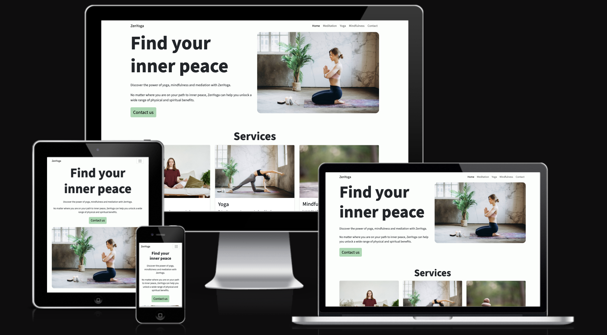
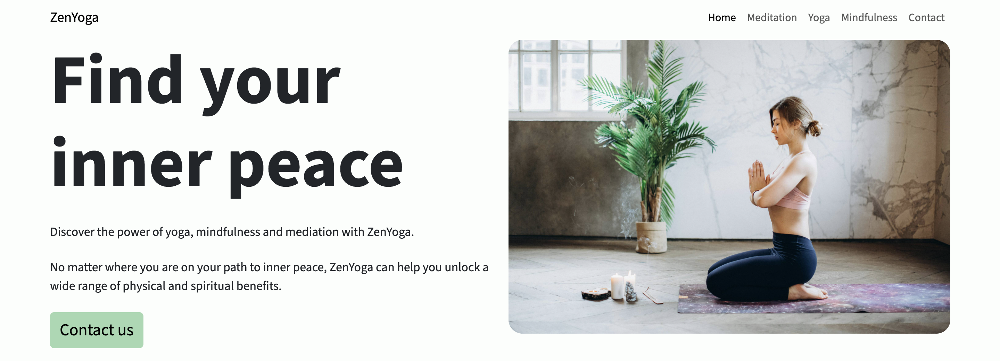
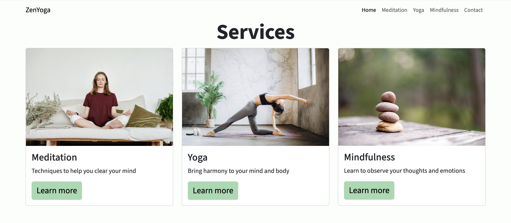
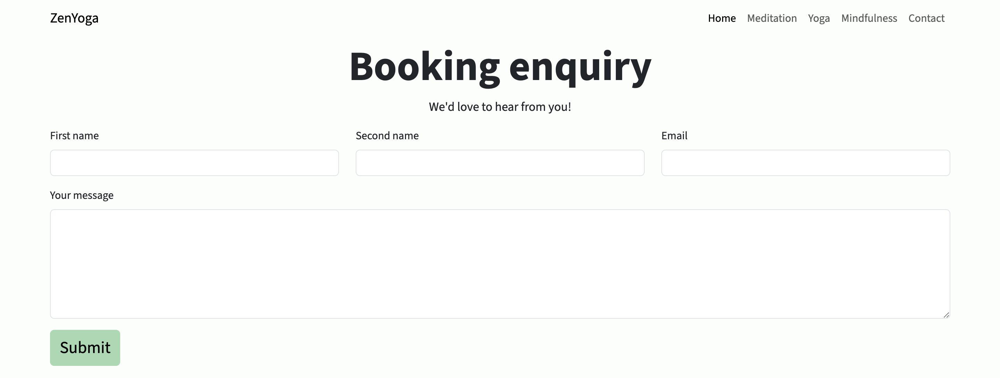
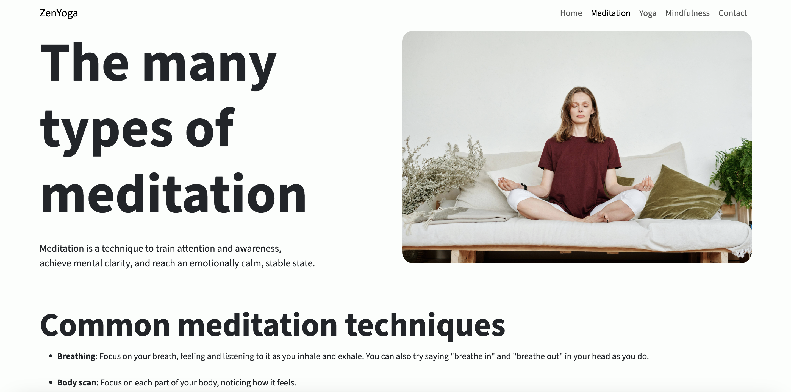
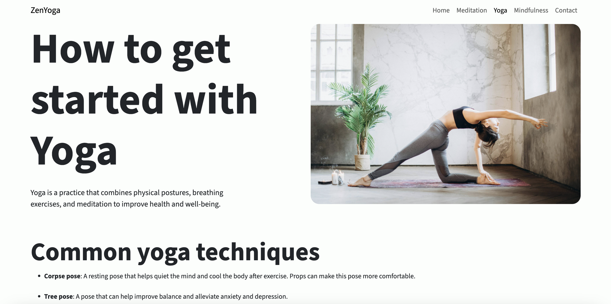
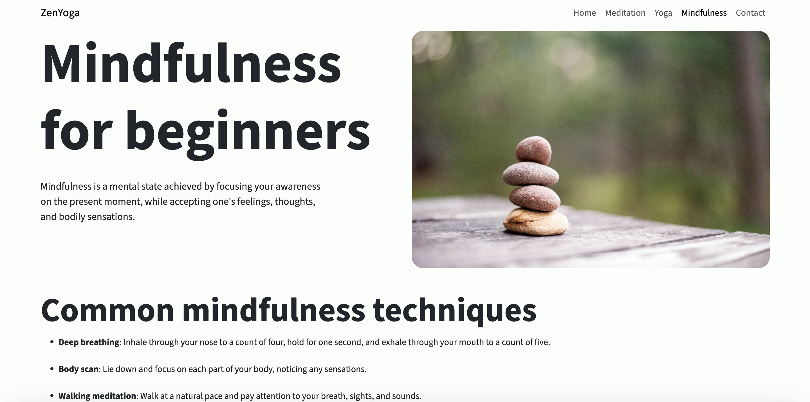

# ZenYoga

ZenYoga is a site that helps users interested in self improvement learn more about meditation, yoga and mindfulness. The site's primary users are beginners and those looking to expand their knowledge of health and wellbeing. ZenYoga will provide users with informative content on the basics and allow them to get in touch to make a booking.

## Features 

The ZenYoga website includes a number of features including a navigation bar, services section, booking enquiery form and footer.

### Existing Features

- __Navigation Bar__

  - Featured on all four pages and the form submitted success page, the fully responsive navigation bar includes links to the Logo, home, meditation, yoga and mindfulness pages. The Contact us link in the navigation bar also takes the user to the booking enquiery section on each page.
  - This section allows the user to easily navigate the site on each page and return to the home page without using the browser's 'back' button.

- __The landing page image and content__

  - The landing page includes an image of someone practicing meditation and welcoming content that explains the purpose of ZenYoga. There is also a call to action in the form of a 'Contact us' button so the user can get in touch to find out more.

- __Services Section__

  - The services section provides the user with an overview of the different services that ZenYoga offers. Each service card includes an image, a brief description and a 'Learn more' button. The user can clearly see that ZenYoga specialises in meditation, yoga and mindfulness. 

- __Booking Enquiry section__

  - This section allows the user to make a booking enquiry with ZenYoga about meditation, yoga and mindfulness sessions. The user will be asked to enter their full name, email address and message before they select the 'Submit' button.
  - On completing the form and selecting 'Submit', the user will see a booking enquiry submitted message to confirm that their enquiery was sent.
  - This section exists towards the bottom of each page so the user can easily contact ZenYoga to make a booking enquiry.  

- __The Footer__ 

  - The footer section includes links to the Facebook, X and Instagram pages for ZenYoga. This helps the user to easily connect with ZenYoga on social media. The links will open on a new tab to allow easy navigation for the user.
  - The footer also includes further contact details so users can easily find ZenYoga or send them an email.

- __Meditation__

  - The Meditation page provides a list of common techniques to help the user learn more about meditation.
  - The user can also make a booking enquiry on this page without the need to return to the home page.

- __Yoga__

  - The Yoga page provides a list of common techniques to help the user learn more about yoga.
  - The user can also make a booking enquiry on this page without the need to return to the home page. 

__Mindfulness__

  - The Mindfulness page provides a list of common techniques to help the user learn more about mindfulness.
  - The user can also make a booking enquiry on this page without the need to return to the home page.

 

### Features Left to Implement

- Booking timetable
- Online booking system

## Testing 

In this section, you need to convince the assessor that you have conducted enough testing to legitimately believe that the site works well. Essentially, in this part you will want to go over all of your project’s features and ensure that they all work as intended, with the project providing an easy and straightforward way for the users to achieve their goals.

In addition, you should mention in this section how your project looks and works on different browsers and screen sizes.

You should also mention in this section any interesting bugs or problems you discovered during your testing, even if you haven't addressed them yet.

If this section grows too long, you may want to split it off into a separate file and link to it from here.

### Validator Testing 

- HTML
  - No errors were returned when passing the home page through the official [W3C validator](https://validator.w3.org/nu/?doc=https%3A%2F%2Fluke-nicklin.github.io%2Fzen-yoga%2Findex.html)
  - No errors were returned when passing the meditation page through the official [W3C validator](https://validator.w3.org/nu/?doc=https%3A%2F%2Fluke-nicklin.github.io%2Fzen-yoga%2Fmeditation.html)
  - No errors were returned when passing the yoga page through the official [W3C validator](https://validator.w3.org/nu/?doc=https%3A%2F%2Fluke-nicklin.github.io%2Fzen-yoga%2Fyoga.html)
  - No errors were returned when passing the mindfulness page through the official [W3C validator](https://validator.w3.org/nu/?doc=https%3A%2F%2Fluke-nicklin.github.io%2Fzen-yoga%2Fmindfulness.html)
  - No errors were returned when passing the success page through the official [W3C validator](https://validator.w3.org/nu/?doc=https%3A%2F%2Fluke-nicklin.github.io%2Fzen-yoga%2Fsuccess.html)

- CSS
  - No errors were found when passing the home page through the official [W3C validator](https://jigsaw.w3.org/css-validator/validator?uri=https%3A%2F%2Fluke-nicklin.github.io%2Fzen-yoga%2Findex.html&profile=css3svg&usermedium=all&warning=1&vextwarning=&lang=en)
  - No errors were found when passing the meditation page through the official [W3C validator](https://jigsaw.w3.org/css-validator/validator?uri=https%3A%2F%2Fluke-nicklin.github.io%2Fzen-yoga%2Fmeditation.html&profile=css3svg&usermedium=all&warning=1&vextwarning=&lang=en)
  - No errors were found when passing the yoga page through the official [W3C validator](https://jigsaw.w3.org/css-validator/validator?uri=https%3A%2F%2Fluke-nicklin.github.io%2Fzen-yoga%2Fyoga.html&profile=css3svg&usermedium=all&warning=1&vextwarning=&lang=en)
  - No errors were found when passing the mindfulness page through the official [W3C validator](https://jigsaw.w3.org/css-validator/validator?uri=https%3A%2F%2Fluke-nicklin.github.io%2Fzen-yoga%2Fmindfulness.html&profile=css3svg&usermedium=all&warning=1&vextwarning=&lang=en)
  - No errors were found when passing the success page through the official [W3C validator](https://jigsaw.w3.org/css-validator/validator?uri=https%3A%2F%2Fluke-nicklin.github.io%2Fzen-yoga%2Fsuccess.html&profile=css3svg&usermedium=all&warning=1&vextwarning=&lang=en)

### Unfixed Bugs

You will need to mention unfixed bugs and why they were not fixed. This section should include shortcomings of the frameworks or technologies used. Although time can be a big variable to consider, paucity of time and difficulty understanding implementation is not a valid reason to leave bugs unfixed. 

## Deployment

This section should describe the process you went through to deploy the project to a hosting platform (e.g. GitHub) 

- The site was deployed to GitHub pages. The steps to deploy are as follows: 
  - In the GitHub repository, navigate to the Settings tab 
  - From the source section drop-down menu, select the Master Branch
  - Once the master branch has been selected, the page will be automatically refreshed with a detailed ribbon display to indicate the successful deployment. 

The live link can be found here - https://code-institute-org.github.io/love-running-2.0/index.html 

## Credits 

In this section you need to reference where you got your content, media and extra help from. It is common practice to use code from other repositories and tutorials, however, it is important to be very specific about these sources to avoid plagiarism. 

You can break the credits section up into Content and Media, depending on what you have included in your project. 

### Content 

- The text for the Meditation page was taken from a Google search result AI overview. The AI overview delivered a summary of meditation techniques from the following sources:
  - NHS
  - MedicalNewsToday
  - Verywell mind
  - Mayo Clinic
  - YouTube
  - Gaiam
  - Insight Timer
  - tonyrobbins.com

- The text for the Yoga page was taken from a Google search result AI overview. The AI overview delivered a summary of yoga techniques from the following sources:
  - Verywell Fit
  - Brio Leisure
  - WorkouLabs

- The text for the Mindfulness page was taken from a Google search result AI overview. The AI overview delivered a summary of mindfulness techniques from the following sources:
  - Mayo Clinic
  - Mindful.org
  - NHS
  - NHS news in health
  - YouTube
  
- The icons in the footer were taken from [Font Awesome](https://fontawesome.com/)

### Media

- The photos used on the home page are from pexels.com

Congratulations on completing your Readme, you have made another big stride in the direction of being a developer! 

## Other General Project Advice

Below you will find a couple of extra tips that may be helpful when completing your project. Remember that each of these projects will become part of your final portfolio so it’s important to allow enough time to showcase your best work! 

- One of the most basic elements of keeping a healthy commit history is with the commit message. When getting started with your project, read through [this article](https://chris.beams.io/posts/git-commit/) by Chris Beams on How to Write  a Git Commit Message 
  - Make sure to keep the messages in the imperative mood 

- When naming the files in your project directory, make sure to consider meaningful naming of files, point to specific names and sections of content.
  - For example, instead of naming an image used ‘image1.png’ consider naming it ‘landing_page_img.png’. This will ensure that there are clear file paths kept. 

- Do some extra research on good and bad coding practices, there are a handful of useful articles to read, consider reviewing the following list when getting started:
  - [Writing Your Best Code](https://learn.shayhowe.com/html-css/writing-your-best-code/)
  - [HTML & CSS Coding Best Practices](https://medium.com/@inceptiondj.info/html-css-coding-best-practice-fadb9870a00f)
  - [Google HTML/CSS Style Guide](https://google.github.io/styleguide/htmlcssguide.html#General)

Getting started with your Portfolio Projects can be daunting, planning your project can make it a lot easier to tackle, take small steps to reach the final outcome and enjoy the process! 
