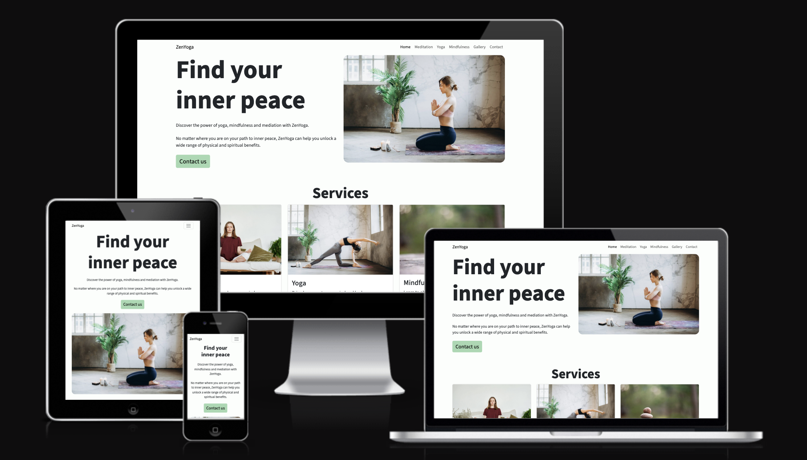
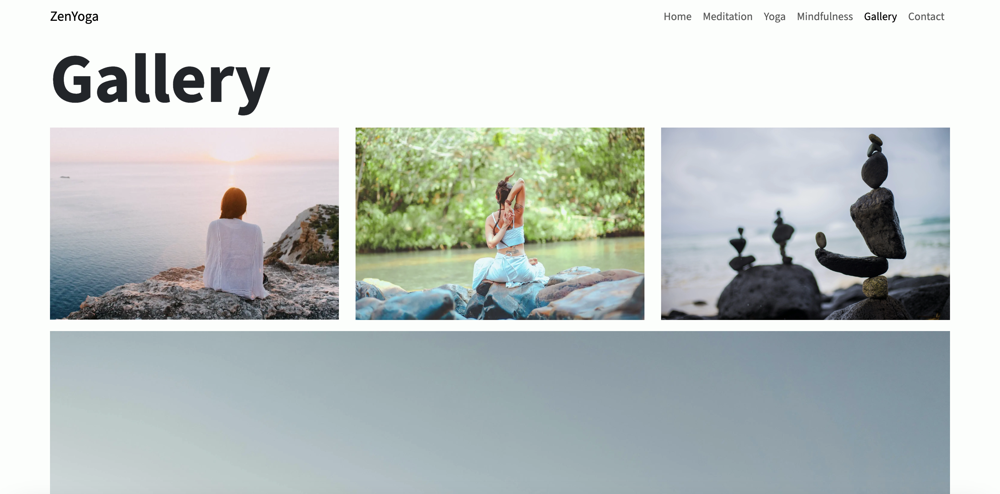

# ZenYoga

ZenYoga is a site that helps users interested in self improvement learn more about meditation, yoga and mindfulness. The site's primary users are beginners and those looking to expand their knowledge of health and wellbeing. ZenYoga will provide users with informative content on the basics and allow them to get in touch to make a booking.

## Features 

The ZenYoga website includes a number of features including a navigation bar, services section, booking enquiery form, gallety and footer.

### Existing Features

__Navigation Bar__

  - Featured on all four pages and the form submitted success page, the fully responsive navigation bar includes links to the Logo, home, meditation, yoga and mindfulness pages. The Contact us link in the navigation bar also takes the user to the booking enquiery section on each page.
  - This section allows the user to easily navigate the site on each page and return to the home page without using the browser's 'back' button.

__The landing page image and content__

  - The landing page includes an image of someone practicing meditation and welcoming content that explains the purpose of ZenYoga. There is also a call to action in the form of a 'Contact us' button.
  - This helps the user to quickly understand the purpose of the website and to get in touch to find out more.

__Services Section__

  - The services section provides the user with an overview of the different services that ZenYoga offers. Each service card includes an image, a brief description and a 'Learn more' button. 
  - The helps the user to clearly see the different services ZenYoga offers and gives them a way to find our more about each service. 

__Booking Enquiry section__

  - This section allows the user to make a booking enquiry with ZenYoga about meditation, yoga and mindfulness sessions. The user will be asked to enter their full name, email address and message before they select the 'Submit' button.
  - On completing the form and selecting 'Submit', the user will see a booking enquiry submitted message to confirm that their enquiery was sent.
  - This section exists towards the bottom of each page so the user can easily contact ZenYoga to make a booking enquiry.  

__The Footer__ 

  - The footer section includes links to the Facebook, X and Instagram pages for ZenYoga. 
  - This helps the user to easily connect with ZenYoga on social media. The links will open on a new tab to allow easy navigation.
  - The footer also includes further contact details so users can locate ZenYoga or send them an email.

__Favicon__

  - A site wide favicon will be implemented with the ZenYoga initials 'ZY'.
  - This will show an image in the tab so users can identify the ZenYoga website when they have multiple tabs open.

  

__404 page__

  - If a user navigates to a broken link, a 404 page will be displayed.
  - The page will let users know that the page they're trying to navigate to doesn't exist and provide them an easy way to return to the home page.

  

__Meditation__

  - The Meditation page provides a list of common techniques to help the user learn more about meditation.
  - The user can also make a booking enquiry on this page without the need to return to the home page.

__Yoga__

  - The Yoga page provides a list of common techniques to help the user learn more about yoga.
  - The user can also make a booking enquiry on this page without the need to return to the home page. 

__Mindfulness__

  - The Mindfulness page provides a list of common techniques to help the user learn more about mindfulness.
  - The user can also make a booking enquiry on this page without the need to return to the home page.

__Gallery__

  - The gallery page showcases different images of people practising mindfulness, yoga and meditation.
  - The images help to show the user what each activity involves and what they will be doing if they booking a session.

 

### Features Left to Implement

- Class timetable
- Online booking system

## Design

### Wireframes

Home page on desktop

Yoga page on mobile

Gallery page on tablet

## Technologies

* HTML
    * The structure of the Website was developed using HTML as the main language.
* CSS
    * The Website was styled using custom CSS in an external file.
* Gitpod
    * The website was developed using Gitpod IDE
* GitHub
    * Source code is hosted on GitHub and delpoyed using Git Pages.
* Git 
    * Used to commit and push code during the development opf the Website
* Font Awesome
    * Icons obtained from https://fontawesome.com/ were used as the Social media links in the footer section. 
* Tinyjpg
    * https://tinyjpg.com/ was used to reduce the size of the images used throughout the website
* Favicon.io
    * favicon files were created at https://favicon.io/favicon-converter/
* Figma
    * Used to design the wireframes and the UI for the ZenYoga website

## Testing

### Responsiveness

All pages were tested to ensure responsiveness on screen sizes from 320px and upwards as defined in [WCAG 2.2 Reflow criteria for responsive design](https://www.w3.org/WAI/WCAG22/Understanding/reflow.html) on Chrome and safari browsers.

Steps to test:

1. Open browser and navigate to [ZenYoga](https://luke-nicklin.github.io/zen-yoga/index.html)
2. Open the developer tools (right click and inspect)
3. Set to responsive and decrease width to 320px
4. Set the zoom to 50%
5. Click and drag the responsive window to maximum width

Expected:

Website is responsive on all screen sizes and no images are pixelated or stretched.

Actual:

Website behaved as expected.

### Accessibility

[Wave Accessibility](https://wave.webaim.org/) tool was used throughout development and for final testing of the deployed website to check for any aid accessibility testing.

Testing was focused to ensure the following criteria were met:

- All forms have associated labels or aria-labels so that this is read out on a screen reader to users who tab to form inputs
- Color contrasts meet a minimum ratio as specified in [WCAG 2.2 Contrast Guidelines](https://www.w3.org/WAI/WCAG22/Understanding/contrast-minimum.html)
- Heading levels are not missed or skipped to ensure the importance of content is relayed correctly to the end user
- All content is contained within landmarks to ensure ease of use for assistive technology, allowing the user to navigate by page regions
- All non textual content had alternative text or titles so descriptions are read out to screen readers
- HTML page lang attribute has been set
- Aria properties have been implemented correctly
- WCAG 2.2 Coding best practices being followed

### Lighthouse Testing

__Home__

__Meditation__

__Yoga__

__Mindfulness__

__Gallery__

### Functional Testing

**Navigation Links**

Testing was performed to ensure all navigation links on the respective pages, navigated to the correct pages as per design. This was done by clicking on the navigation links on each page.

| Navigation Link | Page to Load     |
| --------------- | ---------------  |
| Home            | index.html       |
| Meditation      | meditation.html  |
| Yoga            | yoga.html        |
| Mindfulness     | mindfulness.html |
| Gallery         | gallery.html     |
| Contact         | #booking-enquiry |

Links on all pages navigated to the correct pages as exptected.

### Validator Testing 

- HTML
  - No errors were returned when passing the home page through the official [W3C validator](https://validator.w3.org/nu/?doc=https%3A%2F%2Fluke-nicklin.github.io%2Fzen-yoga%2Findex.html)
  - No errors were returned when passing the meditation page through the official [W3C validator](https://validator.w3.org/nu/?doc=https%3A%2F%2Fluke-nicklin.github.io%2Fzen-yoga%2Fmeditation.html)
  - No errors were returned when passing the yoga page through the official [W3C validator](https://validator.w3.org/nu/?doc=https%3A%2F%2Fluke-nicklin.github.io%2Fzen-yoga%2Fyoga.html)
  - No errors were returned when passing the mindfulness page through the official [W3C validator](https://validator.w3.org/nu/?doc=https%3A%2F%2Fluke-nicklin.github.io%2Fzen-yoga%2Fmindfulness.html)
  - No errors were returned when passing the gallery page through the official [W3C Validator](https://validator.w3.org/nu/?doc=https%3A%2F%2Fluke-nicklin.github.io%2Fzen-yoga%2Fgallery.html)
  - No errors were returned when passing the success page through the official [W3C validator](https://validator.w3.org/nu/?doc=https%3A%2F%2Fluke-nicklin.github.io%2Fzen-yoga%2Fsuccess.html)
  - No errors were returned when passing the 404 page through the official [W3C Validator](https://validator.w3.org/nu/?doc=https%3A%2F%2Fluke-nicklin.github.io%2Fzen-yoga%2F404.html)

- CSS
  - No errors were found when passing the home page through the official [W3C validator](https://jigsaw.w3.org/css-validator/validator?uri=https%3A%2F%2Fluke-nicklin.github.io%2Fzen-yoga%2Findex.html&profile=css3svg&usermedium=all&warning=1&vextwarning=&lang=en)
  - No errors were found when passing the meditation page through the official [W3C validator](https://jigsaw.w3.org/css-validator/validator?uri=https%3A%2F%2Fluke-nicklin.github.io%2Fzen-yoga%2Fmeditation.html&profile=css3svg&usermedium=all&warning=1&vextwarning=&lang=en)
  - No errors were found when passing the yoga page through the official [W3C validator](https://jigsaw.w3.org/css-validator/validator?uri=https%3A%2F%2Fluke-nicklin.github.io%2Fzen-yoga%2Fyoga.html&profile=css3svg&usermedium=all&warning=1&vextwarning=&lang=en)
  - No errors were found when passing the mindfulness page through the official [W3C validator](https://jigsaw.w3.org/css-validator/validator?uri=https%3A%2F%2Fluke-nicklin.github.io%2Fzen-yoga%2Fmindfulness.html&profile=css3svg&usermedium=all&warning=1&vextwarning=&lang=en)
  - No errors were returned when passing the gallery page through the official [W3C Validator](https://jigsaw.w3.org/css-validator/validator?uri=https%3A%2F%2Fluke-nicklin.github.io%2Fzen-yoga%2Fgallery.html&profile=css3svg&usermedium=all&warning=1&vextwarning=&lang=en)
  - No errors were found when passing the success page through the official [W3C validator](https://jigsaw.w3.org/css-validator/validator?uri=https%3A%2F%2Fluke-nicklin.github.io%2Fzen-yoga%2Fsuccess.html&profile=css3svg&usermedium=all&warning=1&vextwarning=&lang=en)
  - No errors were returned when passing the 404 page through the official [W3C Validator](https://jigsaw.w3.org/css-validator/validator?uri=https%3A%2F%2Fluke-nicklin.github.io%2Fzen-yoga%2F404.html&profile=css3svg&usermedium=all&warning=1&vextwarning=&lang=en)

### Bugs

There are currently no known bugs associated with the website.

## Deployment

- The site was deployed to GitHub pages. The steps to deploy are as follows: 
  - In the GitHub repository, navigate to the Settings tab 
  - Select Pages in the Code and automation section of the vertical navigation
  - Once the main branch has been selected, the page will include the live URL at the top of the page with a visit site button. 

The live link can be found here - https://luke-nicklin.github.io/zen-yoga/

## Credits 

### Code

- The site uses components and patterns from Bootstrap.

### Content 

- The text for the Meditation page was taken from a Google search result AI overview. The AI overview delivered a summary of meditation techniques from the following sources:
  - NHS
  - MedicalNewsToday
  - Verywell mind
  - Mayo Clinic
  - YouTube
  - Gaiam
  - Insight Timer
  - tonyrobbins.com

- The text for the Yoga page was taken from a Google search result AI overview. The AI overview delivered a summary of yoga techniques from the following sources:
  - Verywell Fit
  - Brio Leisure
  - WorkouLabs

- The text for the Mindfulness page was taken from a Google search result AI overview. The AI overview delivered a summary of mindfulness techniques from the following sources:
  - Mayo Clinic
  - Mindful.org
  - NHS
  - NHS news in health
  - YouTube
  
- The icons in the footer were taken from [Font Awesome](https://fontawesome.com/)

### Media

- The photos used on the website are from pexels.com